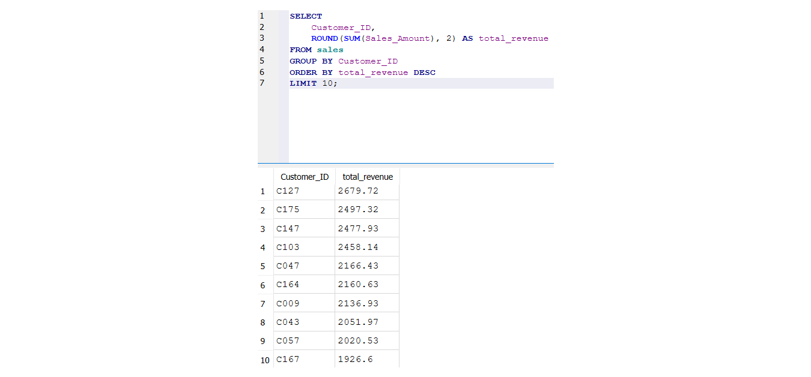
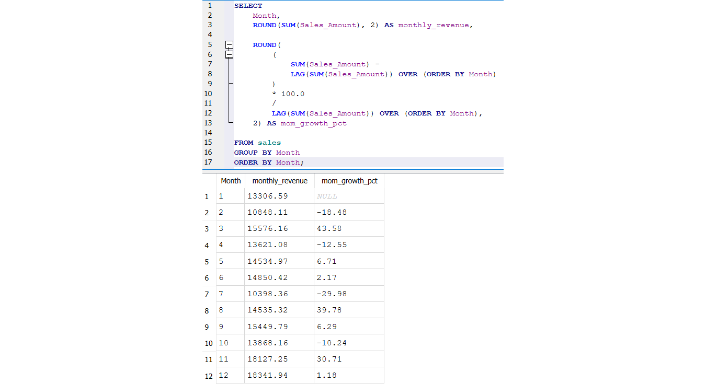
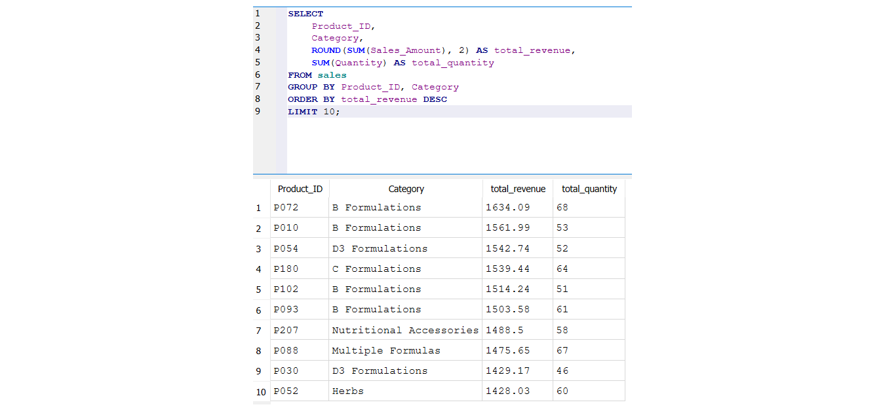

# Pharma Sales SQL Analytics

Business analytics project using SQL and SQLite to analyze sales performance, customer revenue, category trends, product performance, and monthly growth using transactional sales data.

---

# Business Problem

Commercial teams and business managers often need to answer questions such as:
- Which customers generate the highest revenue?
- Which product categories perform best?
- How does revenue evolve over time?
- Which products drive sales performance?
- Are there significant monthly growth fluctuations?

This project uses SQL queries to generate actionable business insights from sales data.

---

# Dataset Overview

The analysis is based on transactional pharmaceutical and supplements sales data, including:
- Orders
- Customers
- Products
- Categories
- Discounts
- Revenue
- Monthly sales activity

The dataset contains:
- 3,629 sales transactions
- 180 customers
- 250 products

---

# Technologies Used

- SQL
- SQLite
- DB Browser for SQLite

---

# SQL Concepts Demonstrated

- Aggregations
- GROUP BY
- ORDER BY
- DISTINCT
- LIMIT
- Revenue calculations
- Ranking analysis
- Window Functions
- LAG() analysis
- Month-over-Month Growth calculations

---

# Key Business Analyses

## 1. Executive KPI Analysis
Calculated:
- Total Revenue
- Total Customers
- Total Orders

---

## 2. Top Customers by Revenue
Identified the highest-value customers based on total sales contribution.

### Query Result



---

## 3. Category Performance Analysis
Analyzed product category contribution to total revenue.

Insights included:
- Strong performance from D3 formulations
- High contribution from Essential Fatty Acids
- Revenue concentration across key categories

---

## 4. Monthly Revenue Trend
Analyzed revenue evolution across the year.

---

## 5. Month-over-Month Growth Analysis
Used SQL Window Functions and `LAG()` to calculate monthly growth percentages.

### Query Result



### Key Insight
Revenue showed significant volatility throughout the year, including:
- strong recovery periods,
- seasonal fluctuations,
- and year-end acceleration.

---

## 6. Top Products Analysis
Identified top-performing products by:
- revenue,
- and sales quantity.

### Query Result



---

# Repository Structure

```text
pharma-sales-sql-analytics/
│
├── data/
│   └── sales.csv
│
├── sql/
│   ├── 01_basic_kpis.sql
│   ├── 02_top_customers.sql
│   ├── 03_category_performance.sql
│   ├── 04_monthly_revenue.sql
│   ├── 05_monthly_growth.sql
│   └── 06_top_products.sql
│
├── results/
│   ├── top_customers.png
│   ├── monthly_growth.png
│   └── top_products.png
│
└── README.md
```

---

# Business Value

This project demonstrates how SQL can support:
- sales analytics,
- customer analysis,
- product strategy,
- revenue monitoring,
- and commercial decision-making.

---

# Author

Paschalis Angelopoulos

- LinkedIn: www.linkedin.com/in/paschalis-angelopoulos-lnkdn
- GitHub: https://github.com/pasxalisag
